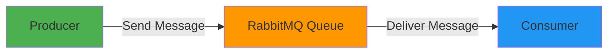
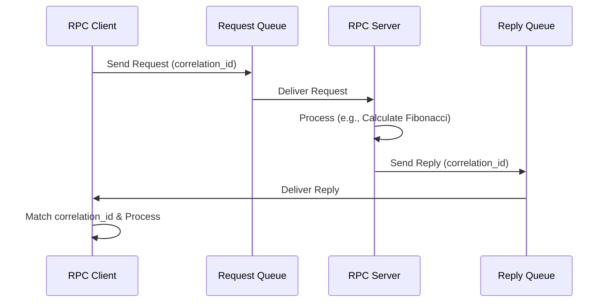
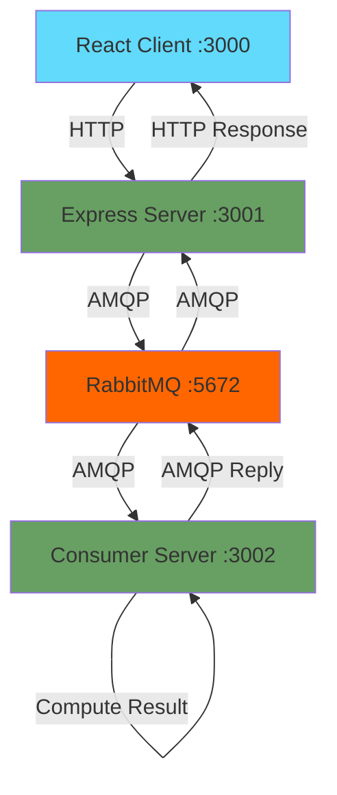

# RabbitMQ Learning

A comprehensive Node.js project demonstrating various RabbitMQ messaging patterns and implementations. This repository contains multiple examples ranging from basic message queuing to advanced RPC (Remote Procedure Call) patterns, along with a full-stack React integration example.

Built in January 2018. This project follows the [RabbitMQ official JavaScript tutorial](https://www.rabbitmq.com/tutorials/tutorial-one-javascript.html) and extends it with practical server implementations.

## Features

- 📨 **Basic Message Queue**: Simple producer-consumer pattern
- 🔄 **Work Queues**: Task distribution among multiple workers
- 🔌 **RPC Pattern**: Request-reply messaging implementation
- 🌐 **Express Integration**: RabbitMQ with web servers
- ⚛️ **React Client**: Full-stack example with React frontend
- 🔧 **Multiple Implementations**: JSON-based and parameter-based RPC variations
- 📊 **Fibonacci Calculator**: Practical RPC example for compute-intensive tasks

## Architecture

### Message Queue Flow



### RPC Pattern Flow



### Full-Stack Architecture



## Getting Started

### Prerequisites

- Node.js (v10 or higher)
- npm or pnpm
- RabbitMQ server (local or Docker)

### Quick Start with Docker

1. Start RabbitMQ:
```bash
docker run -d --hostname rabbitmq --name rabbitmq -p 5672:5672 -p 15672:15672 rabbitmq:3-management
```

2. Clone and run an example:
```bash
git clone https://github.com/orassayag/rabbit-mq-learning.git
cd rabbit-mq-learning/tutorial/one
npm install
```

3. Run receiver (Terminal 1):
```bash
node receive.js
```

4. Run sender (Terminal 2):
```bash
node send.js
```

### Installation

For detailed setup instructions, see [INSTRUCTIONS.md](INSTRUCTIONS.md).

## Project Structure

```
rabbit-mq-learning/
├── tutorial/                           # Official RabbitMQ tutorial examples
│   ├── one/                           # Hello World pattern
│   ├── two/                           # Work Queues pattern
│   └── six/                           # RPC pattern
├── rabbit-RPC-2-servers-test/         # Basic RPC implementation
│   ├── server_consume/                # RPC server (Fibonacci calculator)
│   └── server_producer/               # RPC client (Request sender)
├── rabbit-RPC-2-servers-test-full-json/    # JSON-based RPC
│   ├── server_consume/                # Server with JSON message handling
│   └── server_producer/               # Client with JSON message handling
├── rabbit-RPC-2-servers-test-full-parameters/  # Parameter-based RPC
│   ├── server_consume/                # Server with parameter handling
│   └── server_producer/               # Client with parameter handling
└── rabbit-test/                       # Full-stack integration example
    ├── client/                        # React frontend application
    └── server/                        # Node.js backend with RabbitMQ
```

## Examples Overview

### Tutorial Examples

#### 1. Hello World (`tutorial/one/`)
The simplest possible messaging: one producer sends a message to a queue, and one consumer receives it.

#### 2. Work Queues (`tutorial/two/`)
Distributing time-consuming tasks among multiple workers. Messages are distributed in a round-robin fashion.

#### 3. RPC Pattern (`tutorial/six/`)
Remote Procedure Call implementation. The client sends a computation request (Fibonacci number) and waits for the reply.

### RPC Server Implementations

#### Basic RPC (`rabbit-RPC-2-servers-test/`)
Simple RPC implementation with Express servers. Demonstrates correlation IDs and reply queues.

#### JSON-Based RPC (`rabbit-RPC-2-servers-test-full-json/`)
Enhanced RPC with JSON message formatting for structured data exchange.

#### Parameter-Based RPC (`rabbit-RPC-2-servers-test-full-parameters/`)
RPC implementation with flexible parameter handling and configuration.

### Full-Stack Example (`rabbit-test/`)

Complete application with:
- React frontend for user interaction
- Express backend API
- RabbitMQ message broker
- Fibonacci calculation service

## Key Concepts Demonstrated

### 1. Message Queuing
Messages are stored in queues until consumers are ready to process them.

### 2. Producer-Consumer Pattern
Producers send messages; consumers receive and process them independently.

### 3. RPC (Remote Procedure Call)
Synchronous-like communication over asynchronous message queues using correlation IDs.

### 4. Correlation ID
Unique identifier to match requests with their corresponding replies in RPC patterns.

### 5. Reply Queue
Temporary queue created for each RPC client to receive responses.

### 6. Work Distribution
Tasks are distributed among multiple workers in a round-robin fashion.

## Built With

* [Node.js](https://nodejs.org) - JavaScript runtime environment
* [RabbitMQ](https://www.rabbitmq.com) - Message broker
* [amqplib](http://www.squaremobius.net/amqp.node/) - AMQP client library
* [Express](https://expressjs.com) - Web framework
* [React](https://reactjs.org) - Frontend library
* [Git](https://git-scm.com) - Version control

## Contributing

Contributions to this project are [released](https://help.github.com/articles/github-terms-of-service/#6-contributions-under-repository-license) to the public under the [project's open source license](LICENSE).

Everyone is welcome to contribute. Please read [CONTRIBUTING.md](CONTRIBUTING.md) for details on the contribution process.

## Versioning

We use [SemVer](http://semver.org) for versioning. For the versions available, see the [tags on this repository](https://github.com/orassayag/rabbit-mq-learning/tags).

## Author

* **Or Assayag** - *Initial work* - [orassayag](https://github.com/orassayag)
* Or Assayag <orassayag@gmail.com>
* GitHub: https://github.com/orassayag
* StackOverflow: https://stackoverflow.com/users/4442606/or-assayag?tab=profile
* LinkedIn: https://linkedin.com/in/orassayag

## License

This application has an MIT license - see the [LICENSE](LICENSE) file for details.

## Resources

- [RabbitMQ Official Tutorial](https://www.rabbitmq.com/getstarted.html)
- [AMQP 0-9-1 Protocol](https://www.rabbitmq.com/tutorials/amqp-concepts.html)
- [RabbitMQ Management Plugin](https://www.rabbitmq.com/management.html)
- [amqplib Documentation](http://www.squaremobius.net/amqp.node/)

## Acknowledgments

- RabbitMQ team for excellent documentation and tutorials
- Node.js community for amqplib and related tools
