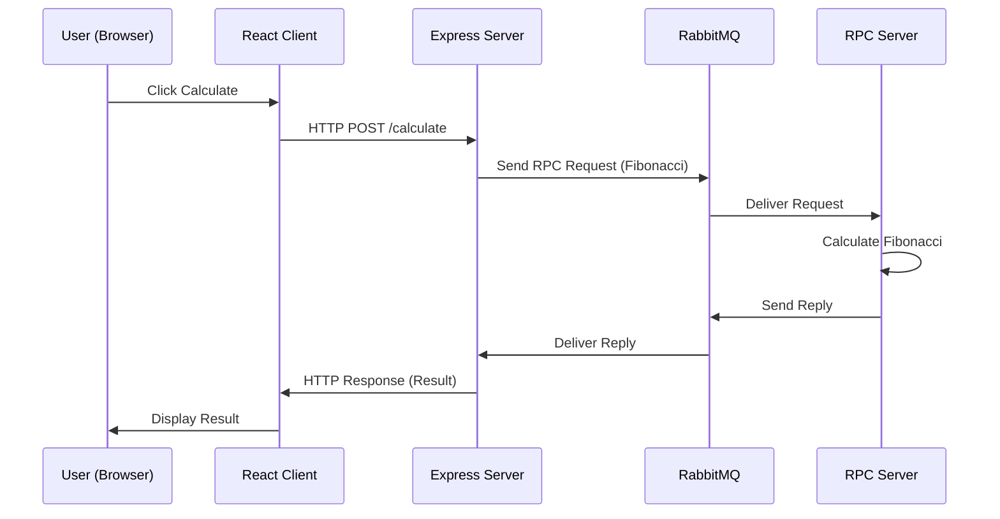

# RabbitMQ React Client

React frontend client for the RabbitMQ learning project. This application demonstrates a full-stack integration with RabbitMQ message broker.

## Architecture



## Features

- Modern React UI
- Integration with RabbitMQ via Express backend
- Real-time Fibonacci calculation demonstration
- Clean component architecture

## Getting Started

### Prerequisites

- Node.js (v10 or higher)
- RabbitMQ server running locally
- Backend server running (see `../server`)

### Installation

```bash
npm install
```

### Running the Application

```bash
npm start
```

The application will open at http://localhost:3000

## Available Scripts

### `npm start`
Runs the app in development mode.

### `npm test`
Launches the test runner.

### `npm run build`
Builds the app for production.

## Project Structure

```
client/
├── config/              # Webpack and build configuration
├── public/             # Static assets
├── scripts/            # Build and start scripts
└── src/               # React source code
    ├── client.js      # RabbitMQ client integration
    ├── index.js       # Application entry point
    └── serviceWorker.js
```

## Built With

* [React](https://reactjs.org) - Frontend library
* [Create React App](https://create-react-app.dev) - Development environment
* [amqplib](http://www.squaremobius.net/amqp.node/) - AMQP client library

## Author

* **Or Assayag** - [orassayag](https://github.com/orassayag)

## License

This project is licensed under the MIT License - see the [LICENSE](../../LICENSE) file for details.
